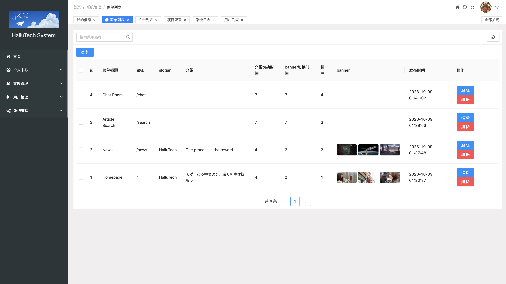
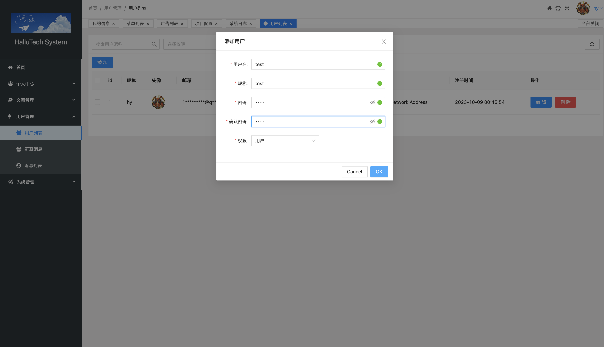
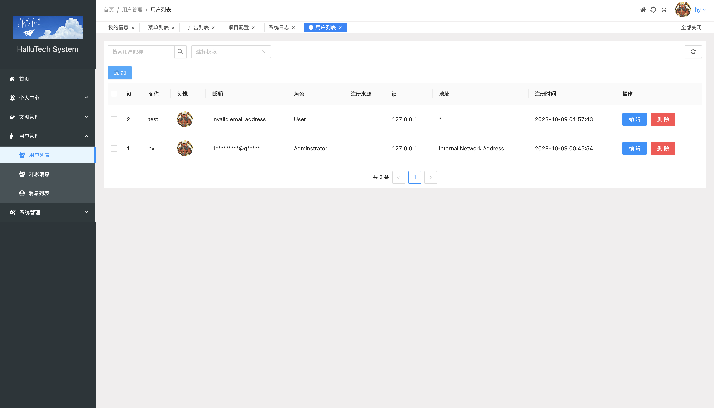

# blog_server
This is the backend for a decoupled personal blog project, with the frontend provided by a collaborator. **This project is built upon gin, gorm, MySQL, Redis, and Elasticsearch.**

## Dependency
- go
- gin
- gorm
- mysql
- redis
- elasticsearch
- jwt-go
- aws-sdk-go
- websocket
- crypto
- logrus

## Main features
- creation, read, deletion, update for advertisement, article, news, images, menu, tag, comment
- User bind email, change password, registration/login(jwt)
- Online chat/groupchat(websocket)
- Login log
- Article categorization, bookmarking, liking, data statistic, full-text search
- Third-party login (reviewing by the third party now)
- Counting the number of comments, articles, article likes, comment likes, and tracking user logins over the past 7 days.(redis+elasticsearch)
- cloud storage(aws)

## Project Structure
```
blog
├── api
│   ├── advertise_api
│   ├── article_api
│   ├── chat_api
│   ├── comment_api
│   ├── image_api
│   ├── log_api
│   ├── menu_api
│   ├── message_api
│   ├── news_api
│   ├── setting_api
│   ├── statistic_api
│   ├── tag_api
│   └── user_api
├── config
├── docs
├── flag
├── global
├── go.mod
├── go.sum
├── initialization
├── main
├── main.go
├── middleware
├── models
│   ├── ctype
│   ├── res
├── plugins
│   ├── aws
│   ├── email
│   ├── log_stash
│   └── qq
├── preview
├── routers
├── service
│   ├── common_service
│   ├── enter.go
│   ├── es_service
│   ├── image_service
│   ├── redis_service
│   ├── synchro_service
│   └── user_service
├── settings.yaml
├── test
│   ├── 1.flag
│   ├── 10.randomNameAvatar
│   ├── 11.log
│   ├── 12.getIpLocation
│   ├── 13.get_internal_ips
│   ├── 2.redis
│   ├── 3.email
│   ├── 4.elasticSearch
│   ├── 5.markdownToHtml
│   ├── 7.sychroFullTextIndexToES
│   ├── 8.recursionComment
│   ├── 9.news
│   └── ６.fullTextSearch
├── uploads
│   ├── avatar
│   ├── chat_avatar
│   ├── file
│   └── system
└── utils
    ├── jwts
    ├── mask
    ├── pwd
    ├── reverse.go
    └── verification
```

## Frontend(fine-tuning)
user login log


user list


homepage


## Deployment
```go
set GOARCH=amd64
set GOOS=linux
go build -o main

mysqldump -uroot -proot blog_db > blog_db.sql
go run main.go -es -dump article_index
go run main.go -es -dump full_text_index


docs
uploads
main
settings.yaml
article_index.json
full_text_index.json
blog_db.sql
```


